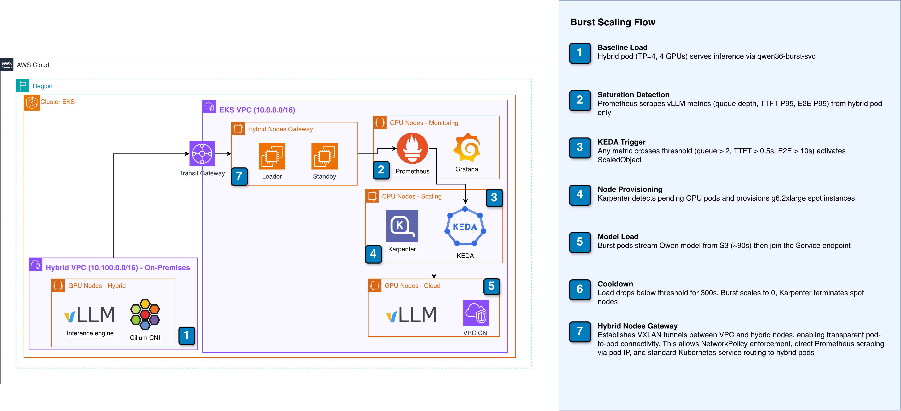
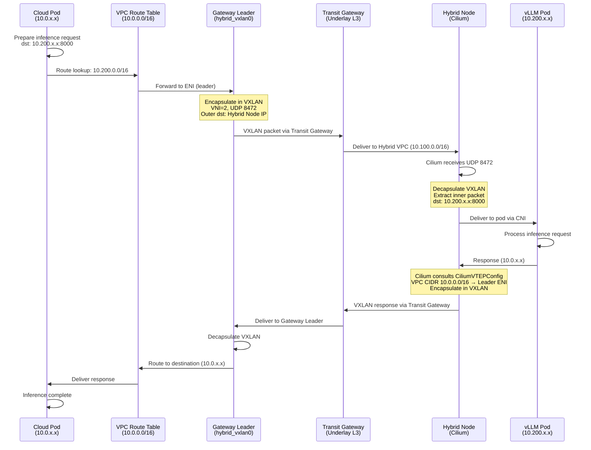
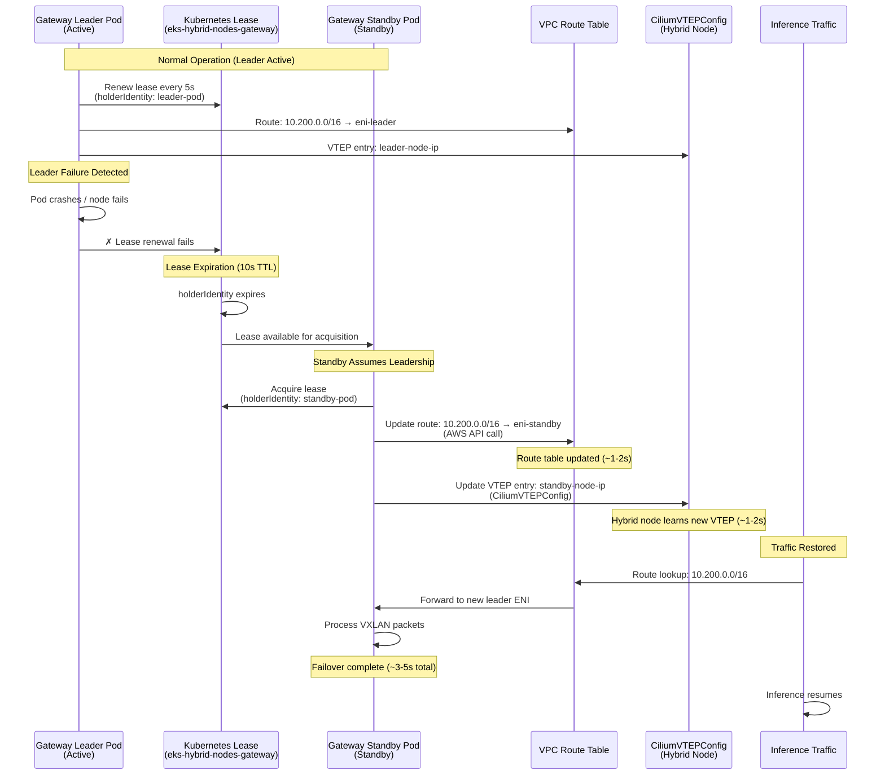

# EKS Hybrid Nodes + Burst Scaling — LLM Inference Platform (VMware vSphere on-premises)


> **Important:** This sample is for demonstration purposes only and should be thoroughly reviewed for security, compliance, and cost implications before any production use. AWS customers are responsible for making their own independent assessment of the information in this document.

LLM inference platform on Amazon Elastic Kubernetes Service (Amazon EKS) with automatic
hybrid-to-cloud burst scaling, where the **on-premises baseline runs on a real VMware
vSphere environment**. The baseline LLM runs on **CPU** on an on-premises vSphere VM
(EKS Hybrid Node) — no GPU required on-premises. When the baseline saturates, KEDA +
Karpenter burst GPU spot capacity in the AWS cloud. Pod-to-pod connectivity between
cloud and on-premises flows through the **EKS Hybrid Nodes Gateway** (VXLAN).

> **This is the VMware flavor** of the upstream sample. The upstream version simulates
> "on-premises" with a second VPC in AWS; this version connects a **real on-premises
> vSphere** datacenter over a Site-to-Site VPN (Transit Gateway). It targets the common
> enterprise scenario: customers running VMware on-premises who want to burst GPU
> workloads to the cloud without buying GPUs for their datacenter.

**Baseline:** Qwen2.5-1.5B-Instruct on **CPU** (vSphere VM, on-premises)
**Burst:** g6/g6e/g7e GPU spot instances (cloud, via Karpenter)
**On-prem transport:** Site-to-Site VPN over Transit Gateway (BGP underlay)
**Pod networking:** EKS Hybrid Nodes Gateway (VXLAN overlay)
**K8s:** 1.35

> See [`docs/vsphere-onprem-setup.md`](docs/vsphere-onprem-setup.md) for provisioning the
> on-premises vSphere hybrid node.

---

## Architecture



### How Burst Scaling Works

1. **Baseline Load**: Hybrid pod (TP=4, 4 GPUs) serves inference with high throughput
2. **Saturation Detection**: KEDA monitors 3 Prometheus metrics from hybrid pod
3. **Trigger**: Any metric crosses threshold → KEDA scales burst from 0 → 1-4 replicas
4. **Provisioning**: Karpenter detects pending GPU pods → provisions GPU spot nodes (g6/g6e/g7e family)
5. **Model Load**: Burst pods stream model from S3 (~90s) → join Service
6. **Cooldown**: Load drops → 300s cooldown → burst scales to 0 → nodes terminated

## Hybrid Nodes Gateway — Network Flow

The Amazon EKS Hybrid Nodes Gateway enables seamless pod-to-pod communication between the Amazon EKS VPC and hybrid on-premises nodes via VXLAN tunnels. This eliminates the need for `hostNetwork: true` on hybrid pods, enabling full Kubernetes networking features: NetworkPolicy enforcement, Application Load Balancer (ALB) target type IP, and mutating webhooks. The Gateway runs in active-standby mode with automatic failover (3-5s) via Kubernetes Lease election.

### Request Flow: VPC Pod → Hybrid Pod



### Gateway Failover: Leader → Standby



**Failover Timeline:**
- **T+0s**: Leader pod crashes or node becomes unreachable
- **T+0-2s**: Standby detects lease expiration (polling interval 15s, but lease TTL 10s)
- **T+2-3s**: Standby acquires lease and updates VPC route table
- **T+3-5s**: Hybrid node learns new VTEP via CiliumVTEPConfig
- **T+5s**: Traffic restored; in-flight requests may timeout and retry

**Benefits of the Gateway Architecture:**

- **No `hostNetwork: true`**: Hybrid pods run with standard pod networking, enabling NetworkPolicy enforcement by Cilium
- **ALB Target Type IP**: Hybrid pods can be registered as ALB targets using pod IP (not node IP), enabling fine-grained traffic distribution
- **Mutating Webhooks**: Admission controllers can inject sidecars or modify pod specs on hybrid nodes (previously blocked by hostNetwork)
- **Cost-Effective HA**: Active-standby with Lease election costs only ~$150-170/month additional (2× m5.large)
- **Transparent to Applications**: No code changes required; pods communicate via standard Kubernetes Service DNS

### Amazon EKS Hybrid Nodes Gateway

The Gateway provides transparent pod-to-pod connectivity between Amazon Virtual Private Cloud (Amazon VPC) pods and hybrid pods via VXLAN tunnels, eliminating the need for `hostNetwork: true`.

- **Nodes:** 2× m5.large (cross-AZ, source/dest check disabled)
- **HA:** Active-standby with Kubernetes Lease (failover ~3-5s)
- **Tunnel:** VXLAN VNI 2, UDP 8472, via Transit Gateway
- **Routing:** VPC route table `10.200.0.0/16` → leader ENI (auto-managed)
- **Cilium:** v1.17.13-1 with VTEP enabled, CiliumVTEPConfig synced
- **Cost:** ~$150-170/month additional

---

## Deployment Instructions

> **Before deploying:** Copy `terraform-live/terraform.tfvars.example` to `terraform-live/terraform.tfvars` and fill in your environment-specific values (region, on-premises CIDRs, VPN customer gateway IP/ASN). See the example file for all required variables.

> **Architecture note:** Unlike the upstream sample (single `terraform apply` that also
> creates the on-premises EC2 node in a simulated VPC), this VMware flavor splits the
> deployment: Terraform provisions the **AWS side** (cluster, VPN, gateway nodes), and
> the **on-premises vSphere VM** is provisioned in your vCenter and joined via `nodeadm`.
> This mirrors how a real on-premises hybrid node is onboarded.

### Prerequisites

| Tool | Version | Install |
|------|---------|---------|
| AWS CLI | v2 | `brew install awscli` |
| Terraform | ≥ 1.5 | `brew install terraform` |
| kubectl | ≥ 1.28 | `brew install kubectl` |
| SSM Plugin | latest | [AWS Docs](https://docs.aws.amazon.com/systems-manager/latest/userguide/session-manager-working-with-install-plugin.html) |
| VMware vSphere / vCenter | — | with capacity for one Ubuntu 22.04 VM (4 vCPU / 8 GB) |
| Site-to-Site VPN edge | — | on-premises router (e.g. pfSense) terminating the VPN, BGP-capable |

### Phase 1: AWS Infrastructure

```bash
cd terraform-live
cp terraform.tfvars.example terraform.tfvars
# Edit terraform.tfvars (region, onprem_node_cidr, remote_pod_cidr,
# customer_gateway_ip, customer_gateway_bgp_asn)
terraform init
terraform apply
aws eks update-kubeconfig --name <cluster_name> --region <region>
```

Creates: Amazon EKS cluster, EKS VPC, Transit Gateway + Site-to-Site VPN (to your
on-premises edge), Hybrid Nodes Gateway nodes, Karpenter, KEDA, GPU Operator (for burst),
Cilium (+VTEP), Prometheus, and the SSM activation for the hybrid node.

Capture these outputs for the next phase: `ssm_activation_id`, `ssm_activation_code`.

### Phase 2: On-premises vSphere hybrid node

Provision the Ubuntu VM in vCenter and join it to the cluster. Full guide:
[`docs/vsphere-onprem-setup.md`](docs/vsphere-onprem-setup.md).

```bash
# On the vSphere VM (after provisioning), run the bootstrap:
sudo CLUSTER_NAME=<cluster_name> REGION=<region> \
     ACTIVATION_ID=<ssm_activation_id> ACTIVATION_CODE=<ssm_activation_code> \
     bash onprem-node-bootstrap.sh
```

### Phase 3: Deploy Burst Scaling

Terraform renders the manifest templates with your environment values. Apply them:

```bash
kubectl apply -f manifests/burst-scaling/rendered/
```

### Phase 4: Verify

```bash
kubectl get nodes                          # managed nodes + 1 on-prem hybrid node, all Ready
kubectl get deploy qwen-hybrid             # 1/1 Ready (CPU baseline on the vSphere node)
kubectl get scaledobject qwen-burst-scaler # Ready=True, Active=False
```

### Phase 5: Run Demo

```bash
bash scripts/demo-burst-scaling.sh
```


---

## Manifests Documentation

All burst-scaling manifests are in `manifests/burst-scaling/`:

| File | Purpose |
|------|---------|
| `01-service.yaml` | Service `qwen36-burst-svc` (round-robin hybrid + burst pods) |
| `02-hybrid-deployment.yaml` | Hybrid pod (TP=4, hostPath model, pod IP via Gateway, 1 replica) |
| `03-burst-deployment.yaml` | Burst pods (TP=1, S3 streaming, 0→4 replicas, spot nodes) |
| `04-keda-scaledobject.yaml` | KEDA triggers (queue depth, TTFT P95, E2E latency P95) |
| `05-servicemonitor.yaml` | Prometheus scrape config for vLLM metrics |
| `06-prometheusrule.yaml` | Recording rules + alerts |
| `07-networkpolicy.yaml` | NetworkPolicy (ingress 8000/TCP from app+monitoring, egress DNS+443+VXLAN) |
| `08-pdb.yaml` | PodDisruptionBudget (min 1 hybrid pod during disruptions) |
| `09-grafana-dashboard.yaml` | Grafana dashboard (TTFT, queue depth, throughput) |
| `11-dcgm-servicemonitor.yaml` | DCGM GPU metrics ServiceMonitor |
| `12-gateway-servicemonitor.yaml` | Gateway metrics ServiceMonitor (port 10080) |
| `13-gateway-alerts.yaml` | PrometheusRule: GatewayLeaderLost, RouteUpdateFailed, ScrapeFailure |

---

## KEDA Scaling Triggers

The `ScaledObject` defines 3 Prometheus triggers filtered to `pod=~"qwen36-hybrid.*"` (hybrid only — prevents feedback loop):

| Trigger | PromQL Query | Activation | Threshold | Rationale |
|---------|-------------|------------|-----------|-----------|
| **Queue Depth** | `sum(waiting) / clamp_min(sum(running), 1)` | 1.5 | 2.0 | Most robust at low load |
| **TTFT P95** | `histogram_quantile(0.95, rate(time_to_first_token_seconds_bucket[2m]))` | 0.3s | 0.5s | Leading indicator of KV-cache pressure |
| **E2E Latency P95** | `histogram_quantile(0.95, rate(e2e_request_latency_seconds_bucket[2m]))` | 7s | 10s | Backstop for long generations |

**Behavior:** OR logic — any single trigger crossing `activationThreshold` activates scaling.

**Parameters:**
- `pollingInterval: 15s` — metric check frequency
- `cooldownPeriod: 300s` — wait 5 min before scale-down
- `minReplicaCount: 0` — scale to zero
- `maxReplicaCount: 4` — max burst capacity

---

## Observability

```bash
# Access Grafana
kubectl port-forward -n monitoring svc/kube-prometheus-stack-grafana 3000:3000
# Login: admin / <grafana_admin_password>
```

**Key Prometheus queries:**
```promql
# Queue depth ratio (KEDA trigger)
sum(vllm:num_requests_waiting{pod=~"qwen36-hybrid.*"}) / 
clamp_min(sum(vllm:num_requests_running{pod=~"qwen36-hybrid.*"}), 1)

# TTFT P95
histogram_quantile(0.95, sum(rate(vllm:time_to_first_token_seconds_bucket{pod=~"qwen36-hybrid.*"}[5m])) by (le))

# GPU utilization
DCGM_FI_DEV_GPU_UTIL
```

---

## Cost Analysis

> **Note:** These cost estimates are approximate and based on on-demand pricing in ap-northeast-1 as of the time of writing. Actual costs may vary based on region, usage patterns, reserved capacity, and AWS pricing changes. Use the [AWS Pricing Calculator](https://calculator.aws/) for up-to-date estimates.


| Component | Cost/month (24/7) |
|-----------|-------------------|
| Amazon EKS Control Plane | ~$73 |
| 3× m5.2xlarge (managed nodes) | ~$830 |
| 2× m5.large (Hybrid Nodes Gateway, HA) | ~$140 |
| NAT Gateway + AWS Transit Gateway + Site-to-Site VPN | ~$135 |
| Burst (spot g6/g6e/g7e, variable, scale-to-zero) | ~$0.30-0.80/pod/hr |
| On-premises baseline (vSphere VM, CPU) | customer-owned (no AWS cost) |
| **Total baseline (cloud)** | **~$1,178/month** |

> The on-premises baseline runs on customer-owned vSphere hardware (no AWS cost), and
> GPU is only paid for during bursts (scale-to-zero). This is the cost advantage of the
> VMware flavor versus an always-on cloud GPU baseline.

---

## Troubleshooting

### On-premises hybrid node not joining (NotReady / not registered)

The vSphere VM joins via `nodeadm` + SSM activation. If it doesn't appear or stays `NotReady`:

```bash
# Is the node registered with SSM? (run from your workstation)
aws ssm describe-instance-information --region <region> \
  --query 'InstanceInformationList[?PlatformName==`Ubuntu`].{ID:InstanceId,Status:PingStatus}' --output table

# On the VM: check kubelet and the bootstrap log
systemctl status kubelet | head -5
tail -50 /var/log/onprem-node-bootstrap.log
```

**Common cause — IAM propagation delay** (`eks:ListAccessEntries` not yet available when
`nodeadm init` first runs). The bootstrap script retries 5×. To re-run manually on the VM:

```bash
sudo nodeadm init --config-source file:///etc/eks/nodeadm-config.yaml
```

The node joins in ~1-2 minutes; the Cilium agent schedules automatically, then the node
becomes `Ready`. See [`docs/vsphere-onprem-setup.md`](docs/vsphere-onprem-setup.md).

### Pod-to-pod cloud ↔ on-premises fails

The Hybrid Nodes Gateway uses VXLAN (UDP 8472) over the VPN. Verify:

```bash
# VPN tunnels UP (from your workstation)
aws ec2 describe-vpn-connections --region <region> \
  --query 'VpnConnections[0].VgwTelemetry[*].Status' --output text

# Gateway pods healthy (active-standby)
kubectl -n eks-hybrid-nodes-gateway get pods -o wide
```

Ensure your on-premises firewall allows UDP 8472 between the hybrid node and the EKS
nodes over the VPN, and that the on-premises router advertises the node/pod CIDRs (BGP).

### Karpenter nodes orphaned after terraform destroy

If you run `terraform destroy` while burst pods are running, Karpenter-provisioned GPU nodes become orphaned (no controller to terminate them). This blocks SG/subnet deletion.

**Fix:**
```bash
# Before terraform destroy, always clean workloads first:
kubectl delete -f manifests/burst-scaling/
kubectl get nodeclaims -w  # Wait until empty

# If already orphaned, terminate manually:
aws ec2 describe-instances --region ap-northeast-1 \
  --filters "Name=tag:karpenter.sh/nodepool,Values=gpu" "Name=instance-state-name,Values=running" \
  --query 'Reservations[*].Instances[*].InstanceId' --output text | \
  xargs aws ec2 terminate-instances --region ap-northeast-1 --instance-ids
```

### Baseline pod crashes with SIGILL / "failed to be inspected" (older CPUs without AVX2)

The official `vllm/vllm-openai-cpu` image is built with AVX2/AVX-512 instructions.
On-premises hosts with older CPUs (e.g. pre-Haswell, AVX1 only) will crash the baseline
pod with `Signals.SIGILL` (Illegal Instruction) while loading the model.

**Check the host CPU flags (on the vSphere VM):**
```bash
grep -m1 flags /proc/cpuinfo | tr ' ' '\n' | grep -iE 'avx|avx2|avx512'
```

**Options:**
- Enterprise datacenters: modern server CPUs (with AVX-512) run the vLLM CPU image as-is.
- Older lab hardware (AVX1 only): use a serving engine with scalar fallback. Ollama
  (`ollama/ollama`, model `qwen2.5:1.5b-instruct`, OpenAI-compatible API on port 11434)
  serves the same model on legacy CPUs. Swap the baseline container image/args accordingly
  and point the Service `targetPort` to `11434`.

### Other issues

See [`docs/hybrid-node-known-issues.md`](docs/hybrid-node-known-issues.md) for 7 additional documented issues (Cilium connectivity, Security Groups, DNS, NVIDIA runtime, etc.)

---

## Cleanup

```bash
# 1. Remove workloads first (prevents orphaned Karpenter nodes)
kubectl delete -f manifests/burst-scaling/
kubectl get nodeclaims -w  # Wait until empty

# 2. Destroy infrastructure
cd terraform-live && terraform destroy
```

---

## Key Design Decisions

| Decision | Rationale |
|----------|-----------|
| 2 deployments (hybrid + burst) | Different configs: TP=4 vs TP=1, hostPath vs Amazon Simple Storage Service (Amazon S3) |
| Amazon EKS Hybrid Nodes Gateway | Pod-to-pod connectivity via VXLAN tunnel; replaces hostNetwork workaround |
| KEDA monitors hybrid only | Prevents feedback loop (burst has worse baseline) |
| Spot instances for burst | 60-70% cheaper, acceptable for overflow |
| AWS Transit Gateway | Cleaner than VPC peering for multi-VPC |
| Single Terraform apply | Reproducible, zero-touch infrastructure |

---

## Testing

Comprehensive test suite covering 90%+ of the architecture with 5 test suites and 28+ assertions.

### Test Suites

| Suite | File | What it tests | Duration |
|-------|------|---------------|----------|
| **Infrastructure** | `tests/test_infrastructure.sh` | Nodes Ready, GPUs allocatable, Cilium CNI, TGW connectivity, Security Groups, DNS cross-VPC | ~2 min |
| **Observability** | `tests/test_observability.sh` | Prometheus scraping, Grafana health, DCGM GPU metrics, vLLM metrics endpoint, ServiceMonitor config | ~2 min |
| **Inference** | `tests/test_inference.sh` | vLLM health, chat completions, streaming SSE, model loaded correctly, TTFT latency, throughput (tokens/s) | ~3 min |
| **Scaling** | `tests/test_scaling.sh` | KEDA ScaledObject Ready, scale-to-zero, Karpenter NodePool config, burst scale-up under load, scale-down after cooldown | ~10 min |
| **End-to-End** | `tests/test_e2e.sh` | Full journey: deploy verification → baseline inference → burst scaling → metrics under load → scale-down | ~15-20 min |
| **Gateway Prerequisites** | `tests/test_gateway_prerequisites.sh` | Cilium VTEP, SNAT exclusion, gateway nodes, Pod Identity Agent | ~1 min |
| **Gateway Connectivity** | `tests/test_gateway_connectivity.sh` | Gateway pods, leader lease, VTEP, migration, NetworkPolicy, KEDA | ~2 min |
| **Gateway Observability** | `tests/test_gateway_observability.sh` | ServiceMonitor, PrometheusRule for gateway | ~1 min |
| **Gateway Failover** | `tests/test_gateway_failover.sh` | Leader election failover within 10s | ~1 min |

### Running Tests

```bash
# All suites (skip E2E for quick validation)
SKIP_E2E=true SKIP_LOAD_TESTS=true /bin/bash tests/run_all.sh

# Single suite
/bin/bash tests/run_all.sh --suite infra

# Full E2E (generates real load, ~20 min)
/bin/bash tests/run_all.sh

# Skip load-generating tests (no burst scaling triggered)
SKIP_LOAD_TESTS=true /bin/bash tests/run_all.sh
```

### Test Report

Results are saved to `tests/results/report_<timestamp>.txt` with pass/fail counts, coverage percentage, and detailed output per suite.

---

## Additional Documentation

- [`docs/hybrid-node-known-issues.md`](docs/hybrid-node-known-issues.md) — 7 documented issues + fixes
- [`docs/cost-analysis-burst-scaling.md`](docs/cost-analysis-burst-scaling.md) — Detailed cost breakdown
- [`docs/test-results-burst-scaling.md`](docs/test-results-burst-scaling.md) — Performance results
- [`manifests/burst-scaling/README.md`](manifests/burst-scaling/README.md) — Full architecture docs

---

## AI/ML Model Information

### Model License

This sample uses the **Qwen 3.6-35B-A3B-AWQ** model, licensed under the **Apache 2.0 License** by Alibaba Cloud. For detailed information about the model, training data, and usage terms, see the [model card on Hugging Face](https://huggingface.co/Qwen/Qwen-3.6-35B-A3B-AWQ).

### Model Integrity Verification

To verify model weights integrity after download from Hugging Face or S3:

```bash
# Generate SHA256 checksum of downloaded model directory
find /opt/models/qwen36-awq -type f -exec sha256sum {} \; | sort -k2 | sha256sum
```

> **Note:** The checksum above validates the complete model directory. Compare against the checksum generated during initial download (stored in S3 metadata or CI artifacts) to detect tampering or corruption.

### GenAI Use Case Classification

| Attribute | Value |
|-----------|-------|
| **Use Case** | General-purpose text generation and inference |
| **Model** | Qwen 3.6-35B-A3B-AWQ (Apache 2.0, Alibaba Cloud) |
| **Risk Category** | Low — demonstration/evaluation only |
| **Prohibited Uses** | NOT for healthcare diagnosis, financial advice, legal counsel, safety-critical systems, or autonomous decision-making |
| **Data Sensitivity** | No PII processed; inference prompts are transient and not persisted |
| **Output Controls** | None implemented (sample only) — production deployments MUST add output filtering |

### Demo and Sample Disclaimer

This is a **demonstration sample** for educational and evaluation purposes only. It is **not production-ready** and comes with no guarantees regarding:
- Model output accuracy or quality
- Model output safety or appropriateness
- Inference performance or reliability
- Compliance with any specific regulatory requirements

Users are solely responsible for evaluating whether model outputs are suitable for their use case.

### Responsible AI and Safety

Users deploying this sample for any production workload are responsible for:
- **Evaluating model outputs** for accuracy, bias, and appropriateness before use
- **Implementing input validation** to sanitize and filter user inputs
- **Implementing output filtering and guardrails** to detect and mitigate harmful, biased, or inappropriate model outputs
- **Monitoring and logging** inference requests and responses for compliance and audit purposes
- **Implementing access controls** to restrict who can invoke the model
- **Reviewing and complying** with applicable laws, regulations, and ethical guidelines in their jurisdiction

### AI Safety Controls

This sample **does not include built-in AI safety controls** such as:
- Input validation or sanitization
- Output content filtering or toxicity detection
- Bias detection or mitigation
- Rate limiting or abuse prevention
- Audit logging or compliance tracking

**You must implement these controls** in your own deployment if using this sample for production workloads or any use case involving real users or sensitive data.

### Dataset and Training Compliance

The Qwen 3.6-35B-A3B-AWQ model was trained by Alibaba Cloud. For information about:
- Training data sources and composition
- Data preprocessing and filtering
- Known limitations or biases
- Training methodology and hyperparameters

Please refer to the [official model card on Hugging Face](https://huggingface.co/Qwen/Qwen-3.6-35B-A3B-AWQ) and Alibaba Cloud's documentation.

---

## Security

This sample follows the [AWS Shared Responsibility Model](https://aws.amazon.com/compliance/shared-responsibility-model/). In this architecture:

- **AWS manages:** EKS control plane security, underlying EC2 host OS patches (for managed nodes), S3 infrastructure encryption, Transit Gateway encryption in transit, and IAM service availability.
- **Customer manages:** Kubernetes workload security, pod-level network policies, IAM policy scoping, secrets management, application-layer encryption (TLS for inference endpoints), AI safety controls, and node OS patching for hybrid nodes.

This sample is intended for educational purposes. For production deployments, review the [threat model](docs/threat-model.md) and implement the hardening recommendations listed below.

### Production Security Hardening

| Priority | Recommendation | Implementation |
|----------|---------------|----------------|
| P0 | Add service mesh mTLS (Istio/Linkerd) for pod-to-pod encryption | `helm install istio istio/istiod -n istio-system` + enable PeerAuthentication STRICT mode |
| P0 | Implement AI guardrails (input validation, output filtering, audit logging) | Deploy NVIDIA NeMo Guardrails or custom middleware; log all requests to CloudWatch |
| P0 | Use AWS Secrets Manager for all credentials (Grafana, SSM activation) | Replace `var.grafana_admin_password` with `aws_secretsmanager_secret` data source |
| P1 | Scope IAM write actions to specific resource ARNs with tag conditions | Add `Condition: {"StringEquals": {"aws:ResourceTag/Environment": "production"}}` |
| P1 | Enable S3 access logging and CloudTrail data events | Add `aws_s3_bucket_logging` resource + `aws_cloudtrail` with S3 data events |
| P1 | Upgrade S3 encryption to SSE-KMS with customer-managed keys | Replace `sse_algorithm = "AES256"` with `aws:kms` + `aws_kms_key` resource |
| P2 | Enable EBS encryption for all node groups | Add `encrypted = true` to all `blockDeviceMappings` in NodeClass specs |
| P2 | Implement rate limiting and authentication on vLLM endpoint | Deploy API Gateway or Envoy proxy with JWT validation + rate limiting |
| P2 | Deploy AWS WAF in front of ALB for external-facing inference | `aws_wafv2_web_acl` with rate-based rule + managed rule groups |

For the full security analysis, see [`docs/threat-model.md`](docs/threat-model.md).

See [CONTRIBUTING](CONTRIBUTING.md#security-issue-notifications) for more information on reporting security vulnerabilities.

---

## License

This library is licensed under the MIT-0 License. See the [LICENSE](LICENSE) file.

---

## Third-Party Services

This sample references the following third-party services that have their own terms and pricing:

- **[Hugging Face](https://huggingface.co/)** — Model hub for downloading the Qwen 3.6-35B-A3B-AWQ model weights
- **[NVIDIA NGC](https://catalog.ngc.nvidia.com/)** — Container registry for GPU operator and device plugin images
- **[AWS Deep Learning Containers](https://github.com/aws/deep-learning-containers)** — Pre-built container images for vLLM inference serving

Users are responsible for reviewing and complying with the terms of service for each third-party service.

---

## References

- [Amazon EKS Hybrid Nodes](https://docs.aws.amazon.com/eks/latest/userguide/hybrid-nodes-overview.html)
- [Amazon EKS Hybrid Nodes Gateway](https://docs.aws.amazon.com/eks/latest/userguide/hybrid-nodes-networking-gateway.html)
- [Karpenter GPU NodePools](https://karpenter.sh/docs/concepts/nodepools/)
- [KEDA Prometheus Scaler](https://keda.sh/docs/scalers/prometheus/)
- [vLLM Production Metrics](https://docs.vllm.ai/en/latest/serving/metrics.html)
- [Cilium on Amazon EKS](https://docs.cilium.io/en/stable/installation/k8s-install-helm/)
