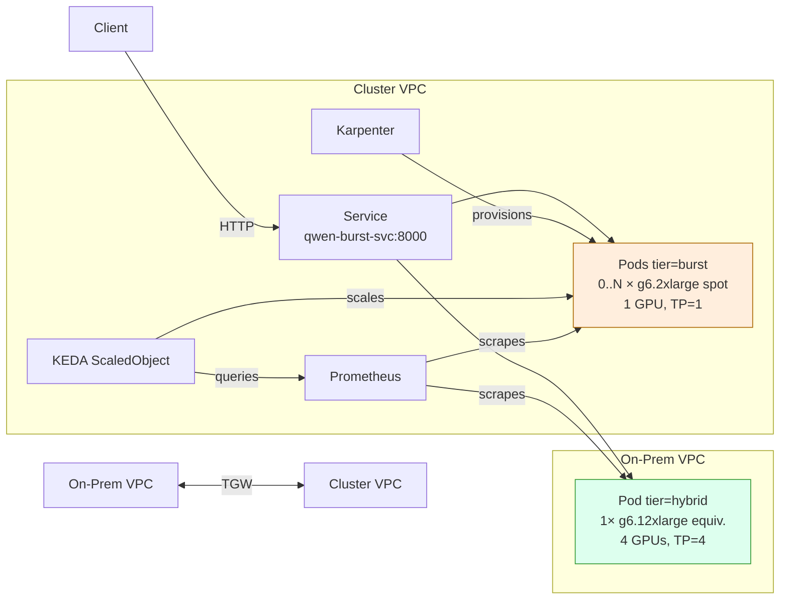

# vLLM Hybrid Burst Scaling on EKS

Burst-scale a vLLM inference service from a baseline Amazon Elastic Kubernetes Service (Amazon EKS) Hybrid Node (on-prem
GPU) into AWS Spot GPU capacity, driven by KEDA on Prometheus signals and
provisioned by Karpenter. Both tiers live behind a single Kubernetes Service
that round-robins traffic across all ready pods.

## Overview



**Key idea:** the hybrid pod stays at full tensor parallelism for steady-state
load. When TTFT, queue depth, or end-to-end latency on the hybrid pod cross
SLO thresholds, KEDA scales `qwen-burst` from 0→N. Karpenter then
provisions `g6.2xlarge` spot nodes; new burst pods stream the model from S3
with `runai_streamer` and join the Service.

## Prerequisites

- EKS cluster (≥ 1.31) with EKS Hybrid Nodes joined and `Ready`
- Transit Gateway (or VPC peering) connecting cluster VPC ↔ hybrid VPC
- Hybrid node security group allows TCP `8000` from cluster pod CIDR
- Karpenter installed with a GPU NodePool labelled `karpenter.sh/nodepool: gpu`
- KEDA ≥ 2.14 installed in `keda` namespace
- `kube-prometheus-stack` (Prometheus + Grafana) in `monitoring` namespace
- NVIDIA device plugin daemonset (cluster + hybrid nodes)
- Amazon Simple Storage Service (Amazon S3) bucket with the AWQ model: `s3://vllm-qwen35b-models/Qwen2.5-1.5B-Instruct/`
- IRSA `ServiceAccount` `model-storage-sa` (`s3:GetObject`, `s3:ListBucket`)
- Hybrid node has the model pre-staged at `/opt/models/qwen-model`

## Deployment

Apply manifests in numeric order — dependencies flow top-down:

```bash
kubectl apply -f manifests/burst-scaling/01-service.yaml
kubectl apply -f manifests/burst-scaling/02-hybrid-deployment.yaml
kubectl apply -f manifests/burst-scaling/03-burst-deployment.yaml
kubectl apply -f manifests/burst-scaling/04-keda-scaledobject.yaml
kubectl apply -f manifests/burst-scaling/05-servicemonitor.yaml
kubectl apply -f manifests/burst-scaling/06-prometheusrule.yaml
kubectl apply -f manifests/burst-scaling/07-networkpolicy.yaml
kubectl apply -f manifests/burst-scaling/08-pdb.yaml
kubectl apply -f manifests/burst-scaling/09-grafana-dashboard.yaml
```

Validate:

```bash
scripts/validate-manifests.sh        # static checks
scripts/integration-test.sh          # live cluster checks
kubectl get scaledobject qwen-burst-scaler   # Ready=True
kubectl get pods -l app=vllm-burst-scaling -o wide
```

Run the load test to demonstrate the burst lifecycle:

```bash
pip install aiohttp
python scripts/load-test.py --endpoint http://qwen-burst-svc:8000
```

## KEDA triggers

The `ScaledObject` defines three Prometheus triggers, all filtered to
`pod=~"qwen-hybrid.*"` so that scaling decisions are driven by **hybrid
saturation**, not aggregate load (which would create a feedback loop).

| Trigger | Query | Activation | Threshold | Rationale |
|---|---|---:|---:|---|
| TTFT P95 | `histogram_quantile(0.95, ... vllm:time_to_first_token_seconds_bucket ...)` | 0.3 s | 0.5 s | Best leading indicator of overload — KV-cache pressure shows up here first. |
| Queue depth ratio | `sum(num_requests_waiting) / clamp_min(sum(num_requests_running), 1)` | 1.5 | 2.0 | Detects scheduler queueing once running batch is saturated. |
| E2E P95 latency | `histogram_quantile(0.95, ... vllm:e2e_request_latency_seconds_bucket ...)` | 7 s | 10 s | Backstop for long generations not captured by TTFT. |

`pollingInterval: 15s`, `cooldownPeriod: 300s`, `maxReplicaCount: 4`.

## Troubleshooting

| Symptom | Likely cause | Fix |
|---|---|---|
| Burst pods stuck `Pending` | No GPU spot capacity in AZ | Inspect `kubectl describe pod`; check Karpenter logs; widen NodePool AZs/instance types |
| Burst pod `CrashLoopBackOff` during model load | Amazon S3 IRSA misconfigured | Verify `model-storage-sa` IRSA role + bucket policy |
| KEDA not scaling under load | Prometheus query returns empty | `kubectl describe scaledobject`; query Prometheus directly; check ServiceMonitor matches |
| Hybrid pod `NotReady` | AWS Transit Gateway route or SG drop | `kubectl logs cilium-...`; verify AWS Transit Gateway route tables; SG must allow 8000 from cluster CIDR |
| Spot interruption mid-request | Expected with spot | KEDA replaces pod automatically; client should retry. For strict SLO, use on-demand fallback in NodePool |
| Service routes to draining burst pod | `terminationGracePeriodSeconds` too short | Already set to 90s; ensure clients honor connection close |

Useful queries:

```bash
kubectl describe scaledobject qwen-burst-scaler
kubectl logs -n keda deploy/keda-operator | tail -100
kubectl get hpa keda-hpa-qwen-burst-scaler -o yaml
```

## Design note: separate deployments vs single HPA

A single Deployment with one HPA cannot express the asymmetry: hybrid uses
TP=4 with `hostPath` model and `Recreate` strategy; burst uses TP=1 with
S3 streaming, longer probes, and scale-to-zero. Splitting the deployments
keeps each one homogeneous (single instance type, single config) while a
shared Service label selector preserves a single endpoint for clients.

## Cleanup

```bash
kubectl delete -f manifests/burst-scaling/
```

This removes Service, both Deployments, KEDA ScaledObject, ServiceMonitor,
PrometheusRule, NetworkPolicy, PDB, and the Grafana dashboard ConfigMap.
Karpenter will deprovision burst nodes once burst pods terminate.

To also tear down infrastructure (TGW, hybrid node, security groups), use
`terraform destroy` from `terraform/`.

## Production notes

- **Connectivity:** AWS Transit Gateway is used here for clean separation. In
  production, replace the simulated on-prem VPC with **AWS Direct Connect
  Gateway** or **Site-to-Site VPN** attached to the same AWS Transit Gateway.
- **Pre-warm:** for strict cold-start SLO, set `minReplicaCount: 1` and
  accept the always-on burst cost (~$511/mo on `g6.2xlarge` spot).
- **Cost:** see [`docs/cost-analysis-burst-scaling.md`](../../docs/cost-analysis-burst-scaling.md)
  for monthly comparisons across traffic patterns.
